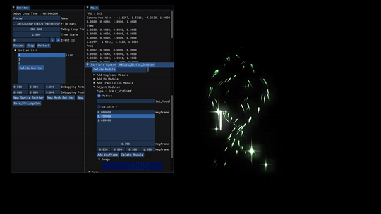
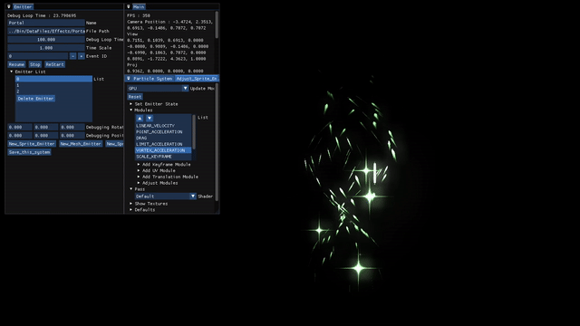
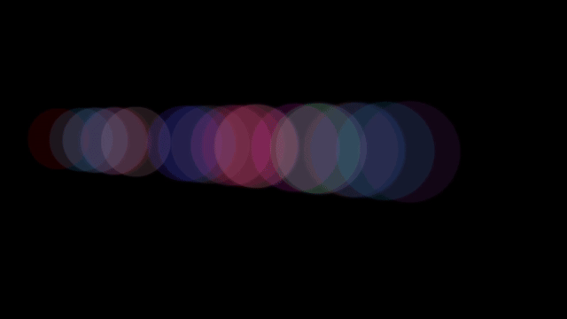

# GPU Particle & Effect System (DirectX 11)

DirectX 11 기반 자체 제작 게임 엔진의 **파티클 / 이펙트 시스템** 코드입니다.
Compute Shader로 파티클을 시뮬레이션하고, 인스턴싱으로 렌더링합니다.

> 이 저장소는 게임 프로젝트 전체에서 파티클 관련 부분만 발췌한 **코드 열람용** 저장소입니다.
> 단독으로 빌드되지 않습니다.

---

## 동작 화면

### 모듈 파라미터 편집



툴에서 모듈을 추가하고 파라미터를 조정하면 파티클에 즉시 반영됩니다. 화면은 `SCALE_KEYFRAME`
모듈의 키프레임 값을 조정하는 모습이며, 편집한 구성은 그대로 JSON으로 저장되어 게임에서 로드됩니다.

### 모듈 실행 순서에 따른 차이



같은 모듈을 쓰더라도 등록된 순서가 바뀌면 최종 움직임이 달라집니다. 각 모듈이 동일한 파티클
버퍼를 순서대로 읽고 쓰기 때문입니다. 따라서 이펙트를 구성할 때는 어떤 모듈을 쓰는지뿐 아니라
어떤 순서로 적용하는지도 하나의 구성 요소가 됩니다.

### WBOIT 적용



반투명 파티클이 정렬 없이 겹쳐 그려지는 모습입니다. 깊이 순서로 정렬하는 대신 가중치를 적용한
색상을 Accumulation 타깃에, 투명도를 Revealage 타깃에 누적한 뒤 한 번에 합성합니다.

---

## 주제별 코드 위치

문서의 각 주제에 해당하는 코드는 다음과 같습니다.

| 문서 주제 | 해당 코드 |
|---|---|
| **모듈 구조 설계 (My-Niagara)** | 모듈 인터페이스 [`Effect_Module`](Engine/Public/Effect_Module.h) · 구현 [`Translation_Module`](Engine/Public/Translation_Module.h) [`Keyframe_Module`](Engine/Public/Keyframe_Module.h) [`UV_Module`](Engine/Public/UV_Module.h) · 조합과 실행 순서 [`Emitter`](Engine/Public/Emitter.h) · 파티클 자료형 [`Engine_Struct.h`](Reference/Engine_Struct.h) |
| **Compute Shader 기반 GPU 업데이트** | 시뮬레이션 [`Shader_CS_Sprite.hlsl`](Shaders/Shader_CS_Sprite.hlsl) [`Shader_CS_Mesh.hlsl`](Shaders/Shader_CS_Mesh.hlsl) · 버퍼(UAV/SRV) [`VIBuffer_Instance`](Engine/Public/VIBuffer_Instance.h) [`VIBuffer_Point_Particle`](Engine/Public/VIBuffer_Point_Particle.h) · 디스패치 [`Particle_Sprite_Emitter`](Engine/Public/Particle_Sprite_Emitter.h) [`Compute_Shader`](Engine/Public/Compute_Shader.h) |
| **WBOIT 반투명 렌더링** | Accumulation / Revealage 출력 [`Shader_VtxPointInstance.hlsl`](Shaders/Shader_VtxPointInstance.hlsl) [`Shader_VtxPoint.hlsl`](Shaders/Shader_VtxPoint.hlsl) |
| **이펙트 데이터화 / 툴** | 로드·세이브 [`Effect_System`](Engine/Public/Effect_System.h) · 실제 데이터 [`Samples/`](Samples) |

> WBOIT의 Render Target 생성과 최종 합성(Composite) 패스는 엔진 렌더러 쪽에 있어 이 저장소에는
> 포함되어 있지 않습니다. 이 저장소에는 파티클이 두 타깃에 기록하는 부분까지가 담겨 있습니다.

---

## 구조

```
CEffect_System                 이펙트 한 덩어리 (JSON 1개 = 시스템 1개)
   └── vector<CEmitter>        이미터 N개. 종류별로 파생
         ├── CSpriteEffect_Emitter    단일 스프라이트 (빌보드 1장)
         ├── CParticle_Sprite_Emitter 스프라이트 파티클 (Point 인스턴싱, GPU 시뮬)
         ├── CMeshEffect_Emitter      단일 메시 이펙트
         └── CParticle_Mesh_Emitter   메시 파티클 (Mesh 인스턴싱, GPU 시뮬)
              │
              ├── vector<CEffect_Module>   파티클에 적용할 동작 모듈
              │     ├── CTranslation_Module  이동/가속 (중력, 항력, 볼텍스, 포인트 가속 …)
              │     ├── CKeyframe_Module     시간에 따른 색상 / 스케일 키프레임
              │     └── CUV_Module           UV 아틀라스 애니메이션
              │
              ├── CVIBuffer_Instance        인스턴스 버퍼 기반 클래스
              │     ├── CVIBuffer_Point_Particle
              │     └── CVIBuffer_Mesh_Particle
              │
              └── CCompute_Shader           GPU 시뮬레이션 디스패치 래퍼
```

### 시뮬레이션 흐름 (한 프레임)

1. `CEffect_System::Update` → 각 `CEmitter::Update_Emitter`
2. 이미터가 `CCompute_Shader`에 상수/`SRV`/`UAV`를 바인딩
3. 컴퓨트 셰이더 패스를 순서대로 디스패치
   `Update` → `Spawn`/`Burst` → 등록된 모듈 패스들(`Gravity`, `Drag`, `Vortex`, `ColorKeyframe`, `UVANIM` …)
4. 시뮬레이션 결과 `StructuredBuffer`를 그대로 인스턴스 버퍼로 사용해 인스턴싱 렌더

파티클 상태는 CPU로 되돌려 읽지 않습니다. 모듈 하나가 컴퓨트 셰이더 패스 하나에 대응하며,
이미터에 모듈을 추가하면 디스패치 체인에 패스가 한 칸 더 붙는 구조입니다.
(툴 프리뷰용 CPU 경로도 `CVIBuffer_Point_Particle::Update_CPU`에 별도로 존재합니다.)

---

## 디렉토리

| 경로 | 내용 |
|---|---|
| `Engine/Public` | 헤더 (`.h`) |
| `Engine/Private` | 구현 (`.cpp`) |
| `Shaders` | HLSL 렌더 셰이더 / 컴퓨트 셰이더 / 공용 `.hlsli` |
| `Reference` | 정점 구조체 정의, 실제 사용 코드 발췌 |
| `Samples` | 실제 게임에서 쓰던 이펙트 정의 JSON |

### 소스 파일

| 파일 | 역할 |
|---|---|
| [`Effect_System`](Engine/Public/Effect_System.h) | 이펙트 컨테이너. JSON 로드/세이브, 이미터 생명주기, 재생 제어 |
| [`Emitter`](Engine/Public/Emitter.h) | 모든 이미터의 부모. 스폰 타입/루프/딜레이/이벤트, 모듈 보관 |
| [`Particle_Sprite_Emitter`](Engine/Public/Particle_Sprite_Emitter.h) | 스프라이트 파티클 이미터 (GPU 시뮬 + Point 인스턴싱) |
| [`Particle_Mesh_Emitter`](Engine/Public/Particle_Mesh_Emitter.h) | 메시 파티클 이미터 (GPU 시뮬 + Mesh 인스턴싱) |
| [`SpriteEffect_Emitter`](Engine/Public/SpriteEffect_Emitter.h) | 단일 스프라이트 이펙트 |
| [`MeshEffect_Emitter`](Engine/Public/MeshEffect_Emitter.h) | 단일 메시 이펙트 |
| [`EffectModel`](Engine/Public/EffectModel.h) | 이펙트 전용 경량 모델 |
| [`Effect_Module`](Engine/Public/Effect_Module.h) | 모듈 기반 클래스 |
| [`Translation_Module`](Engine/Public/Translation_Module.h) | 속도/가속 계열 9종 (`POINT_VELOCITY`, `GRAVITY`, `DRAG`, `VORTEX_ACCELERATION` …) |
| [`Keyframe_Module`](Engine/Public/Keyframe_Module.h) | `COLOR_KEYFRAME`, `SCALE_KEYFRAME` |
| [`UV_Module`](Engine/Public/UV_Module.h) | `UV_ANIM`, `RANDOM_UV_ANIM` |
| [`VIBuffer_Instance`](Engine/Public/VIBuffer_Instance.h) | 인스턴스 버퍼 + UAV/SRV 관리 기반 클래스 |
| [`VIBuffer_Point_Particle`](Engine/Public/VIBuffer_Point_Particle.h) | 스프라이트 파티클 인스턴스 버퍼 |
| [`VIBuffer_Mesh_Particle`](Engine/Public/VIBuffer_Mesh_Particle.h) | 메시 파티클 인스턴스 버퍼 |
| [`VIBuffer_Point`](Engine/Public/VIBuffer_Point.h) | 단일 스프라이트용 Point 버퍼 |
| [`Compute_Shader`](Engine/Public/Compute_Shader.h) | `ID3DX11Effect` 기반 컴퓨트 셰이더 컴포넌트 |

### 셰이더

| 파일 | 역할 |
|---|---|
| [`Shader_CS_Sprite.hlsl`](Shaders/Shader_CS_Sprite.hlsl) | 스프라이트 파티클 GPU 시뮬레이션. **16개 패스** — `Update`, `Spawn`, `Burst`, `Reset`, 가속 계열 8종, `ColorKeyframe`, `ScaleKeyframe`, `UVANIM`, `RANDOMUVANIM` |
| [`Shader_CS_Mesh.hlsl`](Shaders/Shader_CS_Mesh.hlsl) | 메시 파티클 GPU 시뮬레이션. 14개 패스 (UV 애니메이션 제외) |
| [`Shader_VtxPointInstance.hlsl`](Shaders/Shader_VtxPointInstance.hlsl) | 스프라이트 파티클 렌더. **17개 패스** — 빌보드 3종(기본 / Z축 고정 / 속도 방향), Bloom, Dissolve, SubColor, Fire/FireSmoke 조합 |
| [`Shader_VtxMeshInstance.hlsl`](Shaders/Shader_VtxMeshInstance.hlsl) | 메시 파티클 인스턴싱 렌더 |
| [`Shader_VtxPoint.hlsl`](Shaders/Shader_VtxPoint.hlsl) | 단일 스프라이트 렌더 (Weighted Blended / + Bloom) |
| [`Shader_Effect.hlsl`](Shaders/Shader_Effect.hlsl) | 단일 메시 이펙트 렌더. Dissolve, Bloom, Distortion, SubColor 조합 9패스 |
| [`Engine_Shader_Define.hlsli`](Shaders/Engine_Shader_Define.hlsli) | 공용 상수/샘플러/스테이트 정의 |
| [`Engine_Shader_Function.hlsli`](Shaders/Engine_Shader_Function.hlsli) | 공용 함수 |

반투명 파티클은 **Weighted Blended OIT** 로 합성하며, Bloom 대상은 별도 MRT로 분리해 출력합니다.

---

## 데이터 정의 (JSON)

이펙트는 전부 데이터로 기술됩니다. 이미터 종류, 스폰 방식, 텍스처, 모듈 목록과 각 모듈의
파라미터·키프레임까지 JSON에 들어 있고, 에디터에서 편집한 결과가 같은 포맷으로 저장됩니다.
`Samples/` 에 실제 게임 빌드에서 쓰던 정의 파일을 넣어두었습니다.

| 파일 | 내용 |
|---|---|
| [`CyberBulletHit.json`](Samples/CyberBulletHit.json) | 가장 단순한 예시. `BURST_SPAWN` 이미터 2개(32 / 16개), 모듈 4개. 한 번 터지고 끝나는 타격 이펙트 |
| [`Portal.json`](Samples/Portal.json) | 가속 계열 모듈을 폭넓게 쓴 예시. `SPAWN_RATE` 이미터 3개(256 / 256 / 16개), 모듈 15개. `VORTEX_ACCELERATION`, `POINT_ACCELERATION`, `LIMIT_ACCELERATION`, `DRAG` 조합 |
| [`Zip.json`](Samples/Zip.json) | 규모가 가장 큰 예시. 이미터 3개 합계 7,168개, 모듈 10개. `UV_ANIM` 으로 텍스처 애니메이션까지 사용 |

대략적인 구조는 다음과 같습니다.

```jsonc
{
  "Name": "CyberBulletHit",
  "Emitters": [
    {
      "Type": "SPRITE",                      // SPRITE | MESH | EFFECT | SINGLE_SPRITE
      "SpawnType": "BURST_SPAWN",            // BURST_SPAWN | SPAWN_RATE
      "SpawnPosition": "RELATIVE_WORLD",
      "Pooling": "KILL",                     // KILL | REVIVE
      "ShaderPass": "VEL_SUB_DISSOLVE",      // 렌더 셰이더의 패스 이름
      "LoopTime": 1, "DelayTime": 0.08,

      "Buffer": {                            // 파티클 초기 상태. 값마다 SetType으로 분포를 지정
        "Count": 32,
        "LifeTime": { "SetType": "DIRECTSET",    "Arg1": 0.2,   "Arg2": 0.0 },
        "Position": { "SetType": "UNSET",        "Arg1": [...], "Arg2": [...] },
        "Scale":    { "SetType": "DIRECTSET",    "Arg1": [...], "Arg2": [...] },
        "Color":    { "SetType": "DIRECTSET",    "Arg1": [...], "Arg2": [...] },
        "ShapeLocation": { ... }, "UVSet": { ... }
      },

      "Modules": [                           // 각 모듈이 컴퓨트 셰이더 패스 하나에 대응
        { "Type": "MODULE_TRANSLATION", "Module": "POINT_VELOCITY", "Apply": "TRANSLATION",
          "Order": 0, "Init": true,
          "Datas": { "Float":  [ { "Name": "Amount", "Value": 12.0 } ],
                     "Float3": [ { "Name": "Origin", "Value": [0.0, 0.0, 0.05] } ] } },

        { "Type": "MODULE_KEYFRAME", "Module": "SCALE_KEYFRAME", "Apply": "SCALE",
          "Order": 1, "Keyframe": [ ... ] }
      ],

      "Texture": "../Bin/Resources/Textures/Effects/T_FX_CMN_Dust_01_s.dds",
      "Float":  [ { "Name": "AlphaTest", "Value": 0.0 }, { "Name": "DissolveFactor", "Value": 0.0 } ],
      "Float4": [ { "Name": "ColorIntensity", "Value": [...] } ],
      "Transform": { ... }
    }
  ]
}
```

`ShaderPass` 는 렌더 셰이더의 패스 이름을 그대로 가리킵니다. 예를 들어 `Zip.json` 의 세 이미터는
각각 `DEFAULT_DISSOLVE`, `FIRESMOKE`, `SUBCOLOR_BLOOM` 을 사용하며, 모두
`Shader_VtxPointInstance.hlsl` 에 정의된 패스입니다.

